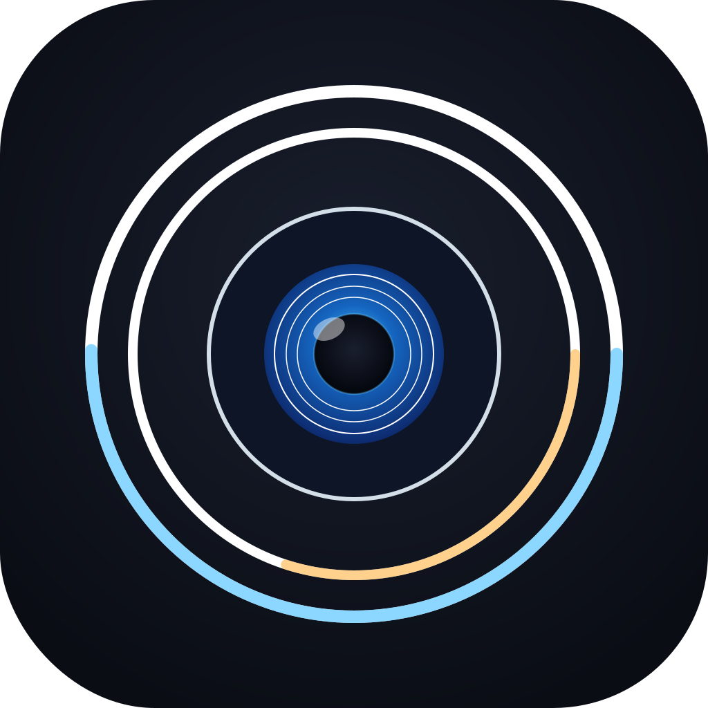

# Iris



A lightweight, always-on-top HUD for macOS — live system vitals and synced song lyrics in a single draggable overlay, so you never have to tab away.

> Status: **work in progress.**


## Features

- **Synced lyrics** — follows Spotify's current track and streams time-synced lyrics from [lrclib.net](https://lrclib.net), scrolling in real time.
- **Album artwork** — shows the current track's cover art alongside the lyric line.
- **Playback progress bar** — a thin bar at the bottom of the overlay tracks position within the current track.
- **System ring gauges** — CPU, GPU, and memory usage as compact ring indicators; network shows live up/down throughput; battery shows charge and charging state.
- **Disk dot gauge** — free space rendered as a phyllotactic disc of dots, filled center-outward; green when healthy, yellow under 20%, red under 5%. Multiple volumes can be monitored side by side (system by default; others opt-in via Settings).
- **Weather tile** — current condition icon plus temperature, fetched from Open-Meteo with IP-based geolocation (no permission, no API key).
- **Audio spectrum visualizer** — live FFT of the system audio output, rendered as bars that can sit above, below, or behind the lyric bar. Volume-scaled and fades out when playback is silent. First use prompts for Screen Recording access.
- **On-call banner** — a compact chip lights up when you're in a call on Teams, Zoom, Slack, Discord, Webex, FaceTime, Skype, LINE, or Google Meet. No private APIs.
- **Draggable overlay** — float it anywhere on screen; position is saved and restored across launches.
- **Menu-bar control** — toggle visibility or open Settings via the `ʟ` status item.

## Planned

- Additional media sources (Apple Music, system-wide Now Playing)
- User-configurable layout and themes
- Per-display positioning

## Requirements

- macOS 14+
- Xcode 15+
- Spotify desktop app (for lyrics)

## Install

Download `Iris.dmg` from the [latest release](https://github.com/LarryHsiao/Iris/releases/latest), mount it, and drag `Iris.app` into `Applications`.

**First launch:** because Iris is a menu-bar-only app (no Dock icon), the usual Gatekeeper confirmation dialog can end up hidden when you double-click. Instead, **right-click `Iris.app` → Open** the first time. After that, launch it normally.

If the app appears to launch but nothing shows up, the quarantine flag is still attached — clear it with:

```bash
xattr -rd com.apple.quarantine /Applications/Iris.app
```

## Build

Open `Iris.xcodeproj` in Xcode and run the `Iris` scheme.

## License

[MIT](LICENSE) © Larry Hsiao
