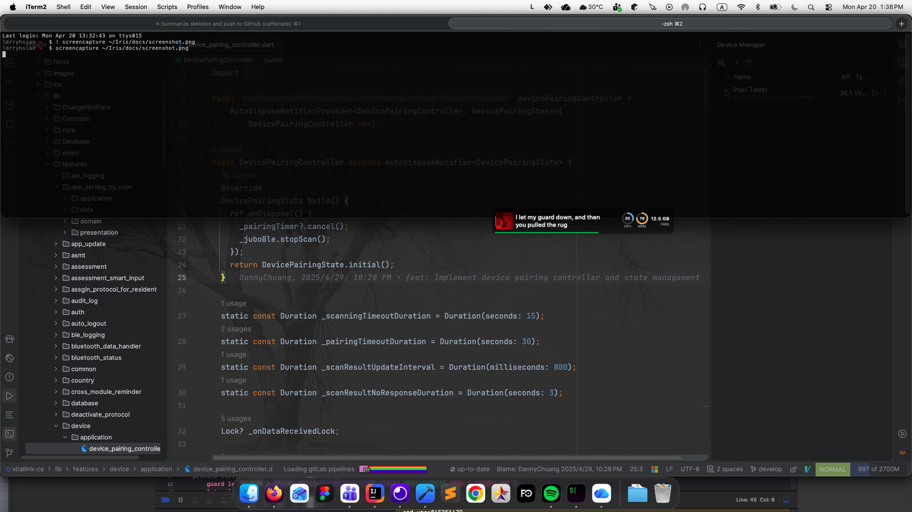

# Iris

A lightweight, always-on-top HUD for macOS — live system vitals and synced song lyrics in a single draggable overlay, so you never have to tab away.

> Status: **work in progress.**

## Features

- **Synced lyrics** — follows Spotify's current track and streams time-synced lyrics from [lrclib.net](https://lrclib.net), scrolling in real time.
- **System ring gauges** — CPU, memory, and disk usage rendered as compact ring indicators.
- **Draggable overlay** — float it anywhere on screen; snaps to the top edge on release.
- **Click-through** — fully transparent to mouse events so it never interrupts your workflow.
- **Menu-bar control** — toggle visibility or quit via the `ʟ` status item.

## Planned

- GPU / memory / network / battery tiles
- Additional media sources (Apple Music, system-wide Now Playing)
- User-configurable layout and themes
- Per-display positioning

## Requirements

- macOS 14+
- Xcode 15+
- Spotify desktop app (for lyrics)

## Build

Open `Iris.xcodeproj` in Xcode and run the `Iris` scheme.

## License

[MIT](LICENSE) © Larry Hsiao
